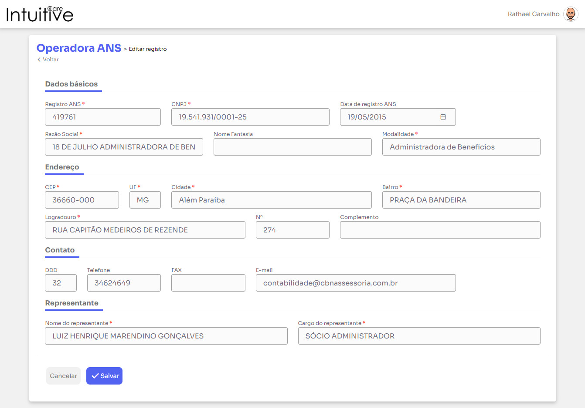

# Intuitive Care Front

Este projeto foi desenvolvido com [VueJs](https://vuejs.org/) e alguns componentes da biblioteca [Primevue](https://www.primefaces.org/primevue/setup)

## Project Setup

### 1. Instalar as dependências do projeto
```sh
npm install
```

### 2. Configurar o endereço da API no arquivo `.env`
```
VUE_APP_BASE_URL=http://localhost:3000
```

### 3. Rodar o projeto
#### - Em modo de desenvolvimento

```sh
npm run serve
```
ou

#### - Em modo de produção
```
npm run build
```

## Capturas de telas

1. Datatable carregando


2. Feedback em caso de erro


3. Datatable preenchido com paginação


4. Popup para pesquisa


5. Datatable com filtro ativo em múltiplos campos


6. Confirmação de exclusão


7. Formulário de cadastro e edição


8. Feedback após o cadastro


9. Validação de campos obrigatórios

